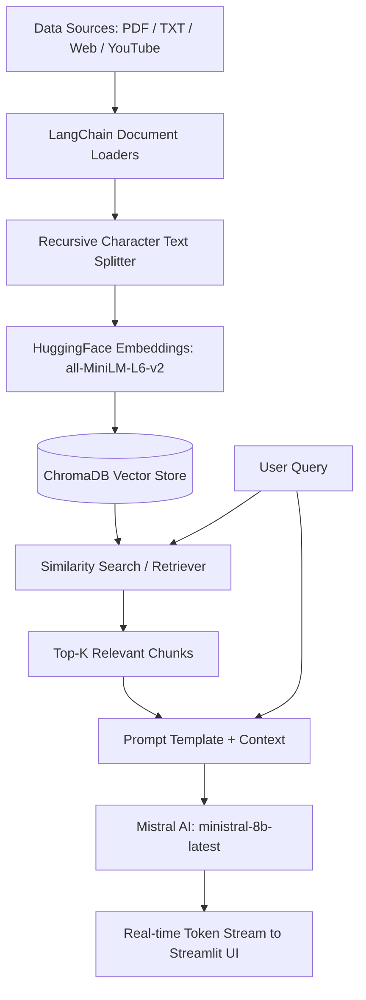

# 🧠 GyanSetu-AI (RAG Intelligence Studio)

> **An advanced Retrieval-Augmented Generation (RAG) platform with multi-source ingestion (PDFs, Webpages, YouTube Videos), semantic ChromaDB search, and real-time streaming LLM synthesis.**

[](https://github.com/Himanshusinghyadavup61)
[](https://www.python.org/)
[](https://streamlit.io/)
[](https://langchain.com/)

---

## 👨‍💻 Created by
**Himanshu Singh Yadav**

---

## 🚀 Key Features

- **Multi-Source Document Ingestion**:
  - 📄 **PDFs**: Full text parsing and chunking (`pypdf`).
  - 📝 **Plain Text**: Supports notes, documentation, and raw transcripts.
  - 🌐 **Web Pages**: Live webpage scraping and content extraction (`WebBaseLoader`).
  - 📺 **YouTube Videos**: Native video transcript extraction across languages (including auto-generated Hindi & English captions via `youtube-transcript-api`).
- **Semantic Vector Storage**:
  - Powered by **ChromaDB** with sentence-level semantic representations.
  - Embeddings generated via `sentence-transformers/all-MiniLM-L6-v2` (384-dimensional dense vectors).
- **ChatGPT-Style Streaming**:
  - Token-by-token streaming via `st.write_stream` and `llm.stream()` for sub-500ms time-to-first-token.
- **Glassmorphic UI**:
  - Interactive telemetry metrics, document preview, YouTube player, and source citation inspector.

---

## 🏗️ System Architecture



---

## 🛠️ Tech Stack

- **Framework**: LangChain (`langchain`, `langchain-community`, `langchain-chroma`, `langchain-mistralai`)
- **LLM**: Mistral AI (`ministral-8b-latest`)
- **Vector Database**: ChromaDB
- **Embeddings**: HuggingFace (`sentence-transformers/all-MiniLM-L6-v2`)
- **Frontend**: Streamlit
- **Package Manager**: `uv`

---

## ⚙️ Installation & Setup

### 1. Clone the Repository
```bash
git clone https://github.com/Himanshusinghyadavup61/GyanSetu-AI.git
cd GyanSetu-AI
```

### 2. Configure Environment Variables
Copy `.env.example` to `.env`:
```bash
cp .env.example .env
```
Fill in your actual API keys:
```env
MISTRAL_API_KEY="your-mistral-api-key"
OPENAI_API_KEY="your-openai-api-key"
GROQ_API_KEY="your-groq-api-key"
```

### 3. Install Dependencies
Using [`uv`](https://github.com/astral-sh/uv):
```bash
uv sync
```

---

## 🖥️ Running the Application

### Launch Interactive Web App
```bash
uv run streamlit run app.py
```
Open **[http://localhost:8501](http://localhost:8501)** in your browser.

### Run CLI Pipelines
- **Test Main RAG Pipeline**:
  ```bash
  uv run python main.py
  ```
- **Test Vector Store Search**:
  ```bash
  uv run python "vector store/db.py"
  ```
- **Test PDF Loader**:
  ```bash
  uv run python "documents loader/pdf.py"
  ```

---

## 📜 License
This project is open-source and available under the [MIT License](LICENSE).
